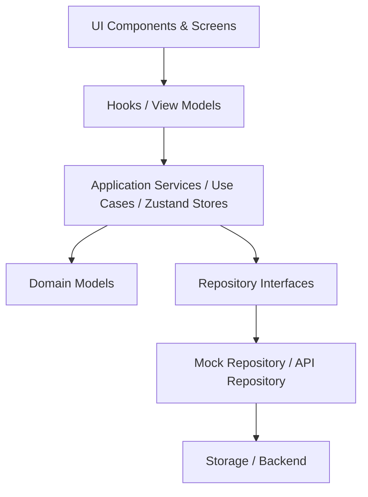
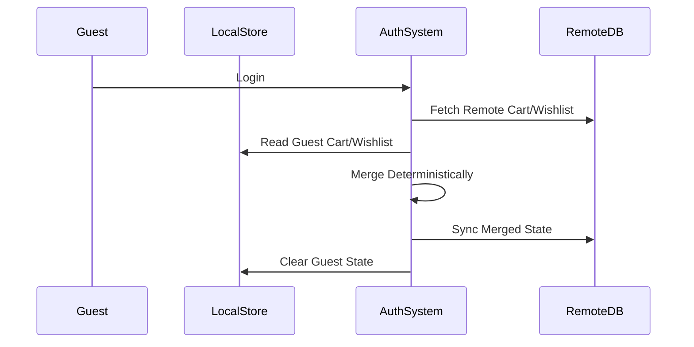
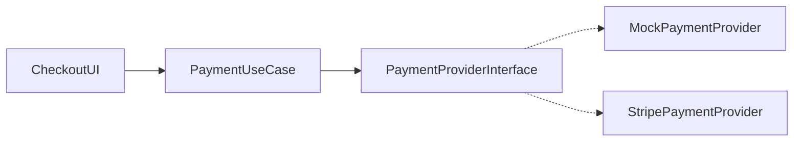
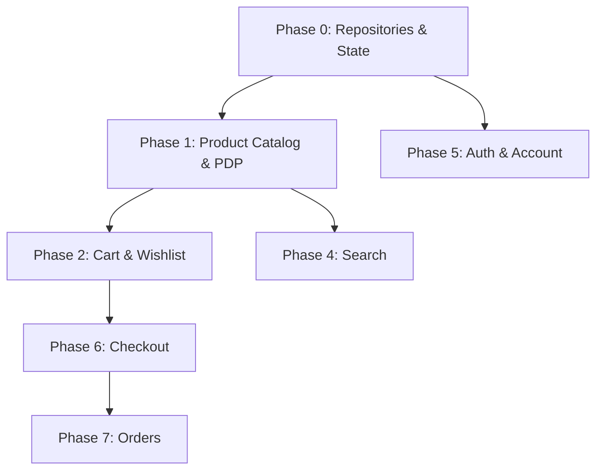

# ElectroStore Functionality Architecture

This document defines the transition architecture for the ElectroStore native mobile application, moving from a static React Native UI to a fully functional, production-ready application.

---

## 1. Application Architecture Boundaries

The application enforces a strict clean architecture to decouple UI from data sources and state management.



**CRITICAL RULE:**
UI components must **NOT** directly access `AsyncStorage`, `SecureStore`, `axios`, `fetch`, database logic, or payment SDKs.
For example, `ProductCard` interacts with a `ProductStore` or `useProducts` hook, which in turn calls `ProductRepository`.

---

## 2. Functional Requirements & Feature Inventory

### Product Discovery
- **Catalog:** Browse product catalog categorized by collections.
- **Search & Filter:** Search input with auto-suggestions. Filtering and sorting.
- **Product Details:** Dedicated PDP outlining specifications, galleries, variants, and stock status.
- **Curated Sections:** New Arrivals, Featured Editions.

### Wishlist
- **Management:** Add/remove items.
- **Guest vs Auth:** Separate guest and authenticated wishlists with deterministic merge behavior upon login.
- **Cart Transfer:** Move individual items or "Move All" to cart.

### Cart & Checkout
- **Cart Management:** Add/remove items, adjust quantities.
- **Summary:** Subtotal, Shipping, Taxes/VAT, Total calculation supporting multiple currencies.
- **Checkout Flow:** Guest and authenticated multi-step process.

### Account & User
- **Authentication:** Registration, Login, Logout, Session management.
- **Profile:** Manage personal details.
- **Orders:** View history and tracking.
- **Settings:** Addresses, payment methods.

---

## 3. Domain Models

The domain models must support extensibility, notably by including a `currency` field rather than hard-coding 'USD'.

```typescript
type User = {
  id: string;
  email: string;
  firstName: string;
  lastName: string;
  isVerified: boolean;
  registeredAt: Date;
}

type Product = {
  id: string;
  slug: string;
  title: string;
  manufacturer: string;
  description: string;
  price: number;
  currency: string; // e.g., 'USD', 'EUR'
  images: string[];
  categoryId: string;
  specifications: Record<string, string>;
  stockStatus: 'IN_STOCK' | 'OUT_OF_STOCK' | 'PRE_ORDER';
  stockQuantity: number;
  badges: string[];
}

type CartItem = {
  id: string; // unique item instance id
  productId: string;
  quantity: number;
  priceAtAdded: number;
  currency: string;
}

type WishlistItem = {
  id: string;
  productId: string;
  addedAt: Date;
}

type Order = {
  id: string;
  userId?: string; // Optional for Guest Orders
  status: 'PENDING' | 'PROCESSING' | 'SHIPPED' | 'DELIVERED' | 'CANCELLED';
  subtotal: number;
  shippingFee: number;
  tax: number;
  total: number;
  currency: string;
  shippingAddressId: string;
  paymentMethodId: string;
  createdAt: Date;
}
```

---

## 4. State Architecture

### Server State (TanStack Query)
- **Purpose:** Manages asynchronous data fetching, caching, synchronization, and invalidation for server-owned data.
- **Usage:** Products, Category lists, Order history, User Profile.

### Client State (Zustand)
- **Purpose:** Synchronous global state.
- **Usage:** Active UI Filters, Checkout Flow state, Search input states.

### Local Persistent State (AsyncStorage / SecureStore)
- **AsyncStorage:** Non-sensitive data like Guest Cart, Guest Wishlist, and UI preferences.
- **SecureStore:** Sensitive authentication tokens (JWTs) and user sessions.

---

## 5. Persistence & Merge Strategy

### Guest vs. Authenticated User Merging
When a Guest logs in, their local (Guest) Cart and Wishlist must merge with the Authenticated user's remote data deterministically.



**Merge Rules:**
- **Duplicate Products:** If a product exists in both guest and remote carts, take the maximum quantity (or remote quantity, based on final business logic definition) to prevent arbitrary loss or doubling.
- **Wishlist:** Union of unique product IDs. No loss of items.
- **Cleanup:** Clear guest state in local storage only *after* a successful merge.

### Logout Behavior
Logout does **NOT** automatically delete all local data.
- **SecureStore:** JWT tokens are purged.
- **Guest State:** The user falls back to a clean/empty Guest state. Auth-specific caches (like order history) are cleared.

---

## 6. Offline / Network Behavior

- **V1 Local-First Development:** Mock repositories and local UI state for Cart/Wishlist will function without network access.
- **Checkout:** Explicitly requires network connectivity.
- **Mutations:** TanStack Query provides cached read state. Offline mutation queuing (e.g., modifying remote cart while offline and syncing later) is **not** implemented in V1; mutations require connectivity or optimistic UI fallback.

---

## 7. Backend Requirements

Future backend APIs required:
- **Auth API:** `/auth/register`, `/auth/login`, `/auth/refresh`
- **Product API:** `/products`, `/categories`, `/search`
- **Cart/Wishlist API:** `/cart`, `/cart/sync`, `/wishlist`, `/wishlist/sync`
- **Checkout API:** `/checkout/intent`, `/orders`
- **User API:** `/user/profile`, `/user/addresses`

---

## 8. Authentication Architecture

- **Flow:** JWT-based stateless auth.
- **Storage:** SecureStore.
- **Registration:** Optional during checkout.

---

## 9. Payment Architecture

**CRITICAL RULE:** Do NOT hard-code Stripe or any specific provider into the core business logic.



The system uses an abstracted `PaymentProvider`. For local development (Phase 0-1), a `MockPaymentProvider` simulates success/failure. When ready, `StripePaymentProvider` is injected.

---

## 10. Navigation Architecture (Expo Router)

```text
app/
├── _layout.tsx
├── (tabs)/
│   ├── index.tsx (Home)
│   ├── wishlist.tsx
│   ├── cart.tsx
│   └── account.tsx
├── product/
│   └── [id].tsx
├── checkout/
│   ├── address.tsx
│   ├── shipping.tsx
│   ├── payment.tsx
│   └── review.tsx
└── auth/
    ├── login.tsx
    └── register.tsx
```

---

## 11. Feature Dependency Graph



---

## 12. Implementation Phases

- **Phase 0 — Architecture Foundation:** Interfaces, Mock Repos, Zustand stores, Storage abstractions. *No features implemented.*
- **Phase 1 — Product Data & Catalog:** Connect Home/PDP to ProductRepository.
- **Phase 2 — Wishlist:** Add/Remove functionality, stock state.
- **Phase 3 — Cart:** Add/Remove, quantities, subtotal logic supporting multi-currency fields.
- **Phase 4 — Search & Filtering:** Connect UI to repository.
- **Phase 5 — Authentication & Account:** Login flows, secure storage, deterministic cart/wishlist merging on login.
- **Phase 6 — Checkout Flow:** Guest and Auth checkout flow using `PaymentProvider` abstraction.
- **Phase 7 — Orders & Tracking:** Post-checkout data flow.

---

## 13. Local-First Development Strategy

We utilize the **Repository Pattern** to decouple the application from an API.

```typescript
interface ProductRepository {
  getProducts(): Promise<Product[]>;
}
// V1 Implementation
export class MockProductRepository implements ProductRepository { ... }
```

---

## 14. Error / Loading / Empty States

- **Loading:** Skeletons for lists, activity indicators for buttons.
- **Empty:** Empty Cart, Empty Wishlist, No Search Results.
- **Error:** Fallback UI boundaries for network failure.
- **Out of Stock:** Grayed UI, disabled cart buttons.
- **Offline:** Banner indicating loss of connectivity; blocked checkout.

---

## 15. Security Considerations

- JWTs stored in `SecureStore`.
- Strict interface boundaries; raw payment details never enter local storage.
- Safe local persistence merging strategies to prevent data leakage between accounts.

---

## 16. Testing Architecture

- **Unit:** Zustand stores, Repository logic, Cart total calculations.
- **Component:** UI behaviors (e.g., quantity buttons).
- **Integration:** Hooks interacting with Mock Repositories.

---

## 17. Environment Strategy

- `development`: Mock repositories active.
- `staging`: Connects to staging API, uses staging keys.
- `production`: Real API, real keys.

---

## 18. Phase 0 Definition of Done

- Application starts successfully.
- Existing UI remains visually unchanged (Typography, spacing, colors, layouts frozen).
- Existing routes continue working.
- Domain models compile.
- Repository interfaces compile.
- Mock repositories return deterministic data.
- Zustand stores hydrate correctly.
- Local persistence abstraction works.
- **No UI component directly accesses storage/network.**
- TypeScript passes with zero errors.
- Expo Go launches successfully.
